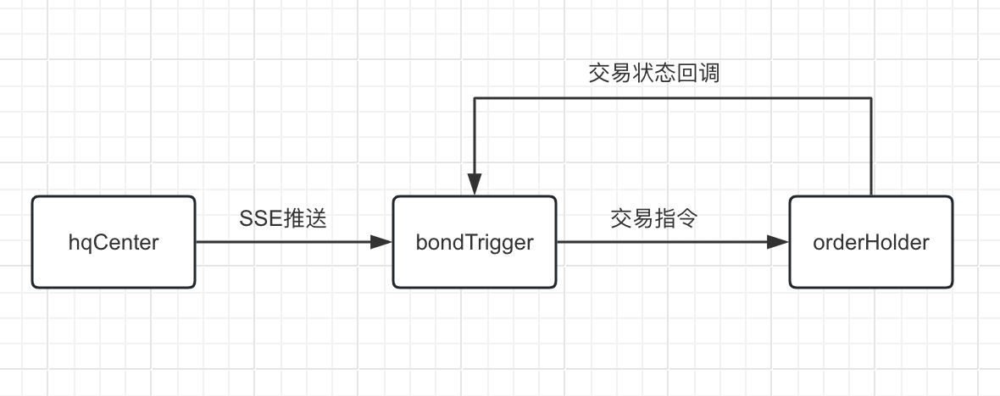
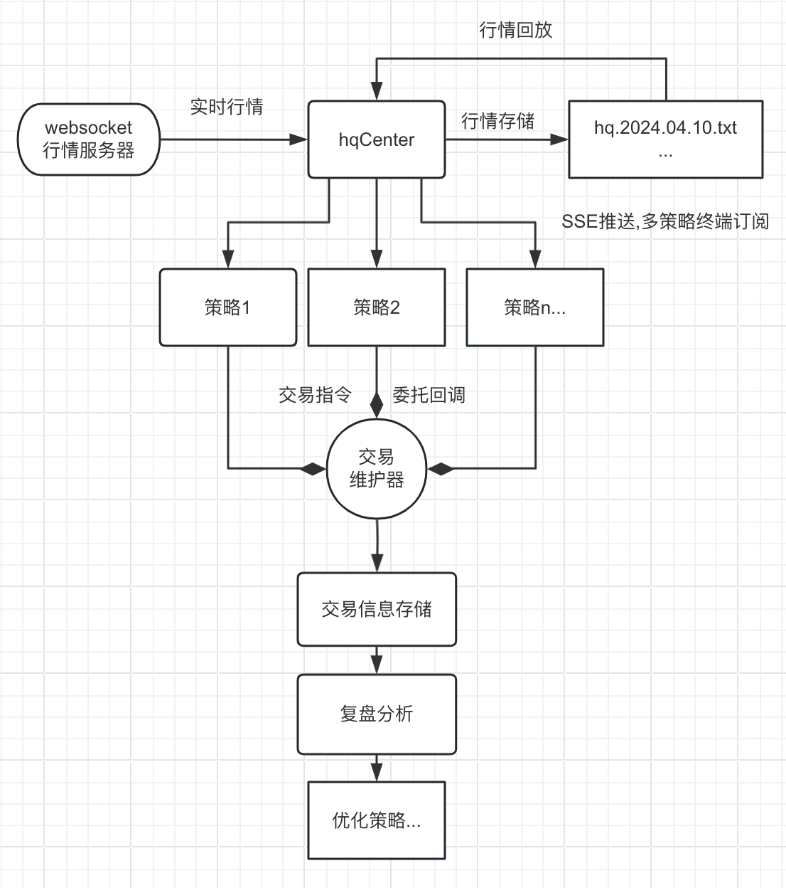

## 说明

- 目前这个项目已编译打包,下载即可测试,直接生成多平台可执行文件，详见运行方法。
- 行情部分与策略弱相关，拆分解耦单独作为一个项目。行情项目请移步https://github.com/freevolunteer/hangqing
- 这个项目只包含策略触发器和交易维护器。
- 策略参数分享了一个比较稳妥的配置，详见data/trigger.json
- 源码全都在,有兴趣可以自己改。项目只做分享，盈亏自负。好的策略思想可以交流，不包写代码:)
- 很多参数都在代码里写好注释了，文档里就不一一介绍了。

## 策略原理
jvQuant平台之前用过该策略，单月收益还行,策略思想大概是模式二，交易频率还有提升空间，所以开发出了频率较高的模式一。
- 债随股动，关注活跃的债和正股，在正股发生异动时买入转债，
- 模式一(atSale不为0),买入成交后立即稍高价格挂出，利用下单速度优势，赚取差价。
- 模式二(atSale为0),买入后经受债价一定波动，到达固定止盈止损点卖出，也可以通过其他渠道手动清仓，交易维护器会自动检测。
- 两种模式支持多个策略配置，单个策略最大同时开仓数由holdCnt设定。

#### 配置解释

```json
[
  {
    //备注
    "comment": "低自盈,短持仓,低触发",
    //最大同时开仓数
    "holdCnt": 3,
    //单仓最大金额
    "amt": 2000,
    //单仓固定手数，如为0则按amt参数计算
    "vol": 0,
    //买单价格比卖一价高挂点数
    "bUpper": 0.02,
    //买单超时时间
    "bWait": 3,
    //买入后立即卖出,比成本价高挂点数;为0则不立即卖出，转为模式二
    "atSale": 0.3,
    //最长持仓时间，超时自动卖出。模式二需设长一点时间。
    "holdSec": 6,
    //自动止盈点数
    "high": 1,
    //自动止损点数
    "low": 0.4,
    //正股观察时间周期
    "sec": 10,
    //正股周期内涨幅阈值
    "raRate": 0.125,
    //正股周期内换手阈值
    "tnRate": 0.005,
    //正股周期内秒均成交额阈值
    "stockAmt": 20,
    //转债秒均成交额阈值
    "bondAmt": 2
  }
]
```

## 项目结构

- 行情中心(hqCenter)
- 策略触发器(bondTrigger)
- T+0交易维护器(orderHolder)



## 功能划分

1. 行情中心(hqCenter)

> 行情中心实现了行情模块的独立,不受策略启停的影响,也负责数据落地和回放。数据原样透传，如何处理需由各策略决定。

2. 策略触发器(bondTrigger)

> 策略模块只关注何时买，何时卖的决策。依赖行情SSE和交易执行器(维护器)。

3. T+0交易维护器(orderHolder)

> 交易维护器负责交易委托的发送，以及委托状态的监视。委托状态发生变更时通知策略触发器。

## 细化的联动关系如图:



## 运行方法

0. 选出需关注的转债和正股，生成对应文件,详见pyscript:

```
hqCenter/data/initCodes.json  预订阅行情代码,应为选出转债和正股的集合
bondTrigger/data/select.json  转债对应的正股配置
bondTrigger/data/shares.json 正股流通股配置文件
bondTrigger/data/trigger.json 策略配置文件,手动编写,各字段含义请见源码注释
```

1. 09:15启动hqCenter，开启本地行情服务器
2. 09:20启动orderHolder,登录交易服务器
3. 09:25启动bondTrigger,运行策略

运行命令示例写在了run.sh里，可以参考。

## 过程干预

- 启停某策略,cid为策略在配置数组里的编号

> http://127.0.0.1:31866/ctl?cid=0&op=on
> http://127.0.0.1:31866/ctl?cid=0&op=off

## 一些数据预准备工作

- pyscript里的python脚本，做了些简单的封装。使用方法示例

```shell
获取正股流通股
python3 pyscript/getStockShares.py --token=jvquantToken --outFile=data/shares.json

筛选转债,获取转债-正股映射
python3 pyscript/bondSelect.py --token=jvquantToken  --outFile=data/select.json
```

- 用到了jvquant的数据API,有其他数据的也行,按格式写入data目录里的文件即可。


### 个人经验和注意事项
- 遵循LGPL开源协议，仅用于学习和交流，尊重作者版权，不得开发二次商用！！！
- 有PTrade或其他量化平台权限的，可以魔改移植,须开源。
- 盈亏自负，建议小仓位试错调优参数，调优前勿猛上仓位！！


